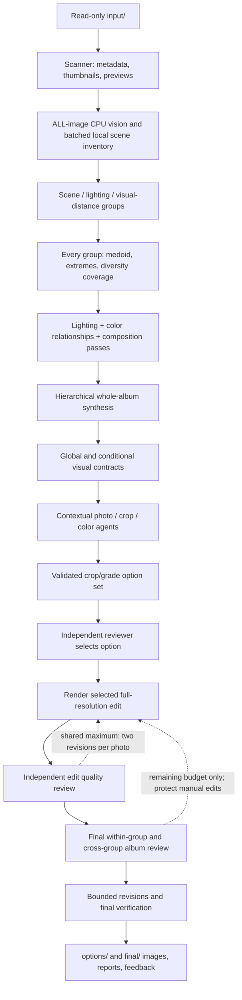

# Architecture

## Project frame

Purpose: coherent, non-destructive local editing of photographic albums.
Users/operators: photographers working on their own machine.
Owner: Unknown; name a maintainer before a public release.
Lifecycle: experimental MVP.
Project type: Python CLI/API with a bundled static browser UI.
Boundaries: one workspace, one active application process, loopback model server, local filesystem.
Non-goals: cloud inference, identity recognition, model training, destructive RAW editing, multi-user hosting.
Neighboring repositories: Unknown. No integrations or meeting records were present in the initial repository.
Success criteria: fresh startup, complete library analysis, conditional contracts, safe export, bounded independent review, protected manual edits, readable reports and repeatable tests.

## Components and flow

| Module | Responsibility |
|---|---|
| `config.py`, `storage.py` | Environment configuration, workspace creation, safe paths, hashes, atomic writes |
| `scanner.py` | Recursive read-only source inventory and cached preview/metadata generation |
| `vision.py` | CPU face/edge analysis, histograms, colors and distribution statistics |
| `album.py` | All-image scene batches, clustering, representative coverage, deep lenses, synthesis, conditional contracts |
| `schemas.py` | Validated decision and review contracts; unknown fields/NaN/extremes rejected |
| `models.py` | Local JSON/image transport, response cache, failure fallback; replaceable `DecisionModel` interface |
| `agents.py` | Contextual photo, crop, color, option-selection and independent quality-review decisions |
| `cropping.py` | Candidate generation, protected regions, multi-objective score and aspect handling |
| `imaging.py` | ICC-aware decoding, RAW adapter, exact pixel constraints, deterministic grading and encoding |
| `pipeline.py` | Ordered analysis gate, asynchronous progress, edits, shared revision budget, final album QA, manual persistence |
| `reports.py` | Actual-parameter summaries, edit records, gallery reports |
| `app.py`, `static/`, `cli.py` | Local API, background jobs, photography review UI and headless workflow |

Runtime dependencies: Pillow, NumPy, OpenCV, Pydantic, FastAPI, HTTPX, Uvicorn. Optional rawpy/LibRaw and an independently installed local model server. Build dependency: Hatchling. Test/dev dependencies: pytest, Ruff, Playwright. No remote application dependency at runtime.

## Album analysis contract

All supported photos receive cheap measurements before editing. Known environment/lighting/category labels create semantic partitions. Within them, deterministic farthest-first splits keep measured visual distance bounded. Groups larger than 24 subdivide for coverage, even if visually similar; these are analysis subgroups, not claims about distinct locations. Each subgroup selects a medoid, extrema on exposure/warmth/contrast/saturation, and additional members until measured-distance coverage is satisfied.

The 8-image scene batch, 6-image deep/review batch, and 24-member analysis subgroup are request/coverage bounds. They do not truncate the library. Each representative batch receives a structured lighting, color and composition analysis in one model request; coverage remains unchanged. All group results reach hierarchical synthesis. Unavailable semantic observations remain `null`/`unknown` and are counted separately from attempted coverage.

The global contract contains photographic principles and normalized style controls. Per-group conditional rules hold bounded offsets, convergence strengths, crop/aspect preferences and legitimate differences. Conditional offsets apply to user global controls; editing warmth globally does not erase indoor/outdoor distinctions. A per-photo context includes original scene evidence, the global contract, its group rule and statistics, global distributions and related representatives.

The basic fallback follows measured groups and restrained convergence strengths. It does not estimate indoor/outdoor labels, expressions, calibrated Kelvin, or intent. Color and exposure matching use original group distributions, never a forced global target. Sparse groups preserve more original variation naturally.

## Decision and safety boundaries

AI returns data only. All responses validate against Pydantic schemas before use. Crop coordinates are normalized against the EXIF-oriented image. The renderer rounds once to exact pixel edges and validates the actual output size. The same checks guard initial crops, manual edits, individual reviewer revisions, final gallery revisions and export. Below-floor images are blocked rather than upscaled. Automatic crops are also constrained by protected regions, a 30% area-removal maximum, and semantic confidence.

Review is a separate model conversation, optionally using `REVIEW_MODEL`. It sees original, edit, actual decisions, contract and related photos. Final QA reviews every final image within groups and representative groups through contact sheets. Initial and final reviews share the same two-revision budget. A final revision is rendered, independently reviewed, and visually verified; unresolved issues become manual-review flags. Measured outliers alone do not justify flattening intentional scene differences.

Manual edits validate against the same hard bounds, are persisted separately and are not revised automatically. Reset uses the recorded automatic version. Feedback records the AI baseline, prior edit, user modification, final result, context and UTC timestamp. A source-hash mismatch blocks stale manual coordinates.

Each process run receives an immutable `output/runs/<run-id>/` directory with exactly two image-delivery directories: `options/` and `final/`. Per-photo reports and machine-readable metadata stay under `reports/runs/<run-id>/`; latest-run report paths remain available to the UI. Previous run outputs are never overwritten.

Grading has an explicit first boundary for every format: full-resolution uncropped grade choices at quality 100 are written to `options/<source>/` before crop planning. Safe crop/grade combinations join them in that same photo folder, including unchanged framing and applicable alternate aspects. A later crop failure therefore does not erase usable graded outputs. After preview comparison, an independent option reviewer chooses one exact candidate using per-photo and album context; the chosen full-resolution JPEG is written to `final/` and receives a separate quality review. Both outputs use quality-100 JPEG encoding.

The per-photo color schema may select natural, monochrome, warm monochrome or restrained cinematic split tone. These treatments are decided for one image at a time; they are not part of the album contract. For a creative RAW choice, the uncropped color alternatives include the selected look and a natural-color option.

The generator pairs safe recommended/tighter/original/semantic/orientation crops with bounded album, soft, crisp, natural and per-photo creative grades. Each candidate has a cached preview and full-resolution JPEG in `options/<source>/`. The option reviewer sees a labeled contact sheet and structured crop/color metrics, alongside the global and cluster contracts, scene analysis, capture metadata, and related images. Its selected ID must match a validated candidate. Crop pixels are validated against original oriented dimensions. The user's manual selection persists as an override. `gallery-editor variants` reuses existing photo analysis and contracts. Crop decisions remain bounded by deterministic geometry, protected-region and resolution constraints; CV edge-centroid values cannot establish photographic intent.

## Cache and scheduling

Metadata/preview keys include source bytes and decoder version. CV keys include source/preview hash and algorithm version. Model keys include prompt version, schema, model ID, endpoint, complete decision context and image hashes. A gallery/contract change therefore invalidates dependent model decisions. Invalid or failed model responses are never cached as successful analysis.

CPU analysis uses `ANALYSIS_WORKERS` threads. The UI starts analysis/processing in background threads and polls stage counters; it stays responsive during local inference. Per-photo analysis remains separate from the joint crop/color plan; review remains an independent call. Model batches run sequentially to avoid exhausting local GPU memory. `reports/performance.json` checkpoints stage timings, per-photo time, source hashing/preview costs, full-resolution decode/render/export costs, and local model HTTP time by role/status. The standalone alternatives pass uses the cached preview and does not decode the RAF again. No five-second target, global sample cap, or album-time shortcut exists.

Full-resolution pixels are used only for deterministic rendering. Model requests use cached previews/contact sheets. RAW uses the same pixel and decision boundaries after decoding. All generated data lives outside `input/`. The service binds to loopback; endpoint validation, disabled redirects/proxies, Host checks and mutation tokens keep local data paths explicit.

## Delivery and operations model

Local loop: `uv sync --frozen --extra dev`, `uv run --extra dev pytest`, `uv run gallery-editor`.
Build/package: `uv build`; versioned wheel and source distribution under `dist/`.
CI gates: Ruff, unit/integration/contract tests, package build, full-resolution synthetic smoke run.
Publish/promote: not configured; local installation only. Release owner: Unknown.
Recovery: stop, retain source/report/override backups, fix configuration and rerun. Preserve records needed to distinguish owned outputs from unrelated files. Older exports remain if a later run blocks a photograph; the report identifies current failure rather than silently deleting files.
Rollback: install a previous wheel and restore backed-up reports/overrides if formats changed.
Health: `/api/health`; progress via `/api/gallery`; model events and scan failures in reports.
Dependency failure: malformed/unavailable models use honest fallback; missing RAW decoder skips RAW with a reason; corrupt images are reported and isolated; invalid crops never reach export.
Known operational limit: one process per workspace; writes are atomic per file, not a multi-file transaction. Disk exhaustion or abrupt shutdown between image and report writes may require moving an unrecognized generated output aside before retrying.
